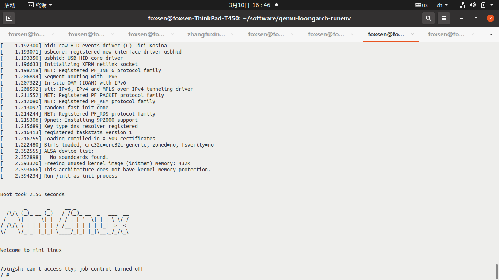
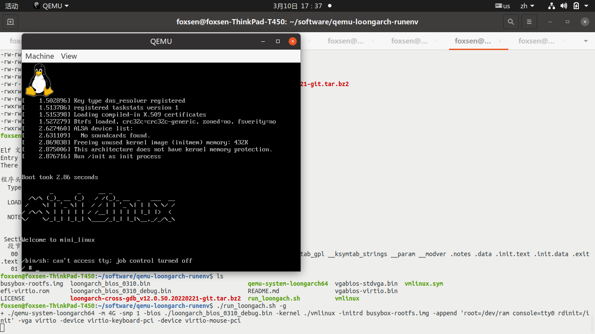
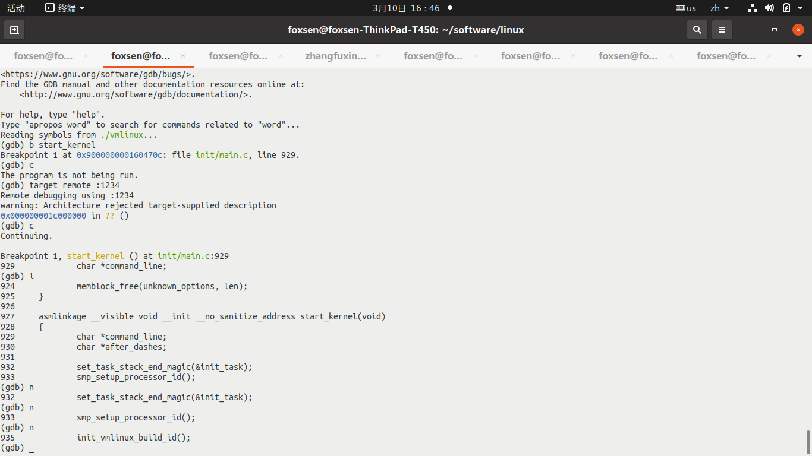

# qemu-loongarch-runenv

This is an environment for running loongarch bios and OS on X86 machines, all
components are open source: 

    * Qemu. The simulator that is used to simulated a loongarch machine on PC.
    * Toolchain. For cross compiling loongarch binaries.
    * Gdb. For cross debugging loongarch binaries that are running inside qemu.
    * UEFI bios. UEFI bios for loongarch.
    * Kernel. Linux kernel for loongarch.

The source code of these components can be found at github.com/loongson.However,
it is not so easy to find  proper combination of all components that can work.
I forked them, make necessary patches and tag the source versions for binaries
here to help you to reproduce and further customizations.

This environment is mainly intended for bios/kernel developers.

## usage

Clone this repository, then run ./run_loongarch.sh. This script has a help:

```bash
Run a loongarch virtual machine.

Syntax: run_loongarch.sh [-b|c|d|D|g|h|i|k|m|q]
options:
b <bios>    use this file as BIOS
c <NCPU>    simulated cpu number
d use -s to listen on 1234 debug port
D use -s -S to listen on 1234 debug port and stop waiting for attach
g     Use graphic UI.
h     Print this Help.
i <initrd> use this file as initrd
k <kernel> use this file as kernel
m <mem> specify simulated memory size
q <qemu> use this file as qemu
```

All options are optional and default values will be used if run without options.

The script is just a wrapper for running qemu with loongarch BIOS, kernel and rootfs.
If you want to use more options of qemu, you can run qemu binary directly. But since
we don't fully install the qemu, it might request for more roms or other materials.
Build and install a qemu by yourself to prevent this kinds of problems.

Examples:

* To run with a qemu GUI: ./run_loongarch.sh -g 
* To run with a debug stub: ./run_loongarch.sh -d or ./run_loongarch.sh -D
* To test your own kernel: ./run_loongarch.sh -k <yourkernel>

The execution of qemu has three major stages:

* First, it loads and run a Loongarch BIOS. The BIOS is a standard UEFI BIOS so you can find many tutorials for using it.
* Second, with -kernel option, the BIOS will try to load and execute the kernel. If no -kernel option given, it will run a UEFI shell.
* Third, with -initrd option and given kernel cmdline, the linux kernel will try to run a minimal system.

Default booted interface without any options:



Booted interface with ./run_loongarch.sh -g



## emulated machine

This qemu emulator emulates a target machine ‘virt’, which is different from a real loongarch machine. The real loongarch machine today can have many different brands and configuration, but most of them are using Loongson3A5000/Loongson3B5000/Loongson3C5000 CPUs, and Loongson7A1000/7A2000 bridge chips. While the 'virt' machine, as its name indicates, use qemu's virtio framework to simulate all kinds of peripherals, such as the disk, the network adapter and so on.

The machine and cpu supported:

    foxsen@foxsen-ThinkPad-T450:~/software/qemu-loongarch-runenv$ ./qemu-system-loongarch64 -M ?
    Supported machines are:
    none                 empty machine
    virt                 Loongson-3A5000 LS7A1000 machine (default)
    foxsen@foxsen-ThinkPad-T450:~/software/qemu-loongarch-runenv$ ./qemu-system-loongarch64 -cpu ?
    Loongson-3A5000-loongarch-cpu

For the CPU part, most Loongson3A5000 features are supported, so that the open source loongson kernel can be directly used. You can refer to Loongson Architecture Manuals and Loongson3A5000 manual for more details, check https://github.com/loongson/LoongArch-Documentation for them.

For the machine part, you can add any virtio device to the machine via qemu's command line options. For example, we are using these options to add vga/keyboard/mouse to the machine:

    -vga virtio -device virtio-keyboard-pci -device virtio-mouse-pci

Read qemu's manual for adding more devices if needed. If you want to write a driver for these devices, refer to the linux kernel. You can use -device ? option to show all the devices that can be added.

Beside the virtio devices, the Loongson7A1000 bridge's pcie controller, UART serial port, Real Time Clock and power management ports are emulated. For example, you can find a 16550 serial port at physical address 0x1fe001e0, a RTC port at 0x10085010, PCI config space at 0x20000000, IO at 0x18004000UL, and so on. Read the code in qemu's source directory hw/loongarch and the 7A1000 manual to find more information. Refer to the linux kernel source for example usage of this devices.

## files 

Here is a short explanation for major files in this repository:

* qemu-system-loongarch64. The emulator binary, meant to be run on Linux/X86_64. Built on ubuntu 20.04.
* vgabios-stdvga.bin, efi-virtio.rom, vgabios-virtio.bin. Some rom files used by qemu.
* loongarch_bios_0310.bin, loongarch_bios_0310_debug.bin. The loongarch UEFI bios binary.
* vmlinux. The loongarch linux kernel binary.
* busybox-rootfs.img. A minimal root file system for linux/loongarch built out of busybox 1.35.0.
* loongarch-cross-gdb_v12.0.50.20220221-git.tar.bz2. Cross gdb to debug loongarch binaries on X86. sudo tar xjvf -C /opt/

## source and build methods

For bios, kernel and busybox, the resulting code is loongarch, so a cross compiling toolchain is needed. Used toolchain is [here](https://github.com/loongson/build-tools/releases/download/2021.12.21/loongarch64-clfs-2021-12-18-cross-tools-gcc-full.tar.xz). Unpack this package to /opt, then add /opt/cross-tools/bin to your PATH. 

    foxsen@foxsen-ThinkPad-T450:~/xinyan/algo$ /opt/cross-tools-1218/bin/loongarch64-unknown-linux-gnu-gcc -v
    Using built-in specs.
    COLLECT_GCC=/opt/cross-tools-1218/bin/loongarch64-unknown-linux-gnu-gcc
    COLLECT_LTO_WRAPPER=/opt/cross-tools-1218/bin/../libexec/gcc/loongarch64-unknown-linux-gnu/12.0.0/lto-wrapper
    Target: loongarch64-unknown-linux-gnu
    Configured with: ../configure --prefix=/opt/cross-tools --build=x86_64-cross-linux-gnu --host=x86_64-cross-linux-gnu --target=loongarch64-unknown-linux-gnu --with-sysroot=/opt/cross-tools/target --disable-multilib --enable-nls --enable-__cxa_atexit --enable-threads=posix --with-system-zlib --enable-libstdcxx-time --enable-checking=release --enable-languages=c,c++,fortran,objc,obj-c++,lto
    Thread model: posix
    Supported LTO compression algorithms: zlib zstd
    gcc version 12.0.0 20211202 (experimental) (GCC)

This toolchain has two known flaws on ubuntu platforms: 

1. Due to statically linking, the bfd plugin libdep.so will lead to failures. rm -f /opt/cross-tools/lib/bfd-plugins/libdep.so can fix it.
2. Also due to statically linking, the locale handling is not so right that it fail the kernel script check. run the following command before make:

    export LC_ALL=C; 
    export LANG=C;
    export LANGUAGE=C

Otherwise you will see error like this:

      HOSTCC  scripts/kconfig/symbol.o
      HOSTCC  scripts/kconfig/util.o
      HOSTLD  scripts/kconfig/conf
    loongarch64-unknown-linux-gnu-gcc: unknown assembler invoked
    scripts/Kconfig.include:50: Sorry, this assembler is not supported.
    make[2]: *** [scripts/kconfig/Makefile:77：syncconfig] 错误 1
    make[1]: *** [Makefile:619：syncconfig] 错误 2
    make: *** [Makefile:721：include/config/auto.conf.cmd] 错误 2
    make: *** [include/config/auto.conf.cmd] 正在删除文件“include/generated/autoconf.h”

Will update this when a better version is released.

Note: Please use given toolchain. Don't use gcc from gcc.org. Support for loongarch is not yet upstreamed! And we need a cross compiling toolchain, that is, running on x86 and producing code for loongarch.
Note: Please DON'T use gcc8 from loongnix: the ABI is changing! we are using the lastest open source BIOS and kernel code, which requires open source toolchain(gcc v12.x).

### qemu

The binary here is built from https://github.com/foxsen/qemu.git tag loongarch-v2022-03-10-1 on ubuntu 20.04.

git clone https://github.com/foxsen/qemu.git
<install necessary dependence packages, refer to qemu build doc>
git checkout loongarch-v2022-03-10-1
cd qemu
mkdir build
cd ./build/
../configure --target-list=loongarch64-softmmu --disable-werror (调试版本加--enable-debug)
make -j4

Check branch loongarch for possible updates.

### UEFI bios

The binary here is built from https://github.com/foxsen/{edk2.git,edk2-platforms.git} tag loongarch-v2022-03-10 on centos stream 8.


On ubuntu 20.04 the following error is met so we change to a centos platform:

    foxsen@foxsen-ThinkPad-T450:~/software/uefi$ build --buildtarget=DEBUG --tagname=GCC5 --arch=LOONGARCH64  --platform=Platform/Loongson/LoongArchQemuPkg/Loongson.dsc
    Build environment: Linux-5.4.0-100-generic-x86_64-with-glibc2.29
    Build start time: 00:21:56, Mar.10 2022

    WORKSPACE        = /home/foxsen/software/uefi
    PACKAGES_PATH    = /home/foxsen/software/uefi/edk2:/home/foxsen/software/uefi/edk2-platforms:/home/foxsen/software/uefi/edk2-non-osi
    EDK_TOOLS_PATH   = /home/foxsen/software/uefi/edk2/BaseTools
    CONF_PATH        = /home/foxsen/software/uefi/edk2/Conf
    PYTHON_COMMAND   = /usr/bin/python3.8


    Architecture(s)  = LOONGARCH64
    Build target     = DEBUG
    Toolchain        = GCC5

    Active Platform          = /home/foxsen/software/uefi/edk2-platforms/Platform/Loongson/LoongArchQemuPkg/Loongson.dsc

    Processing meta-data ......

    build.py...
     : error F000: CC_PATH doesn't exist in GCC5 ToolChain and LOONGARCH64 Arch.
        [/home/foxsen/software/uefi/edk2/MdeModulePkg/Universal/PCD/Pei/Pcd.inf]
    .

    - Failed -
    Build end time: 00:22:03, Mar.10 2022
    Build total time: 00:00:07

Build method:

```bash
git clone https://github.com/foxsen/edk2.git
git checkout loongarch-v2022-03-10
git clone https://github.com/foxsen/edk2-platforms.git
git checkout loongarch-v2022-03-10
```

Refer to edk2-platforms Platform/Loongson/LoongArchQemuPkg/Readme.md for detail build instructions.

For debug build, resulting bios binary is Build/LoongArchQemu/DEBUG_GCC5/FV/QEMU_EFI.fd.
For release build, resulting bios binary is Build/LoongArchQemu/RELEASE_GCC5/FV/QEMU_EFI.fd.

Check loongarch-qemu branch of edk2 and edk2-platforms for updates.

### linux kernel

The binary here is built from https://github.com/foxsen/linux.git tag loongarch-v2022-03-10-1 on ubuntu 20.04.

git clone https://github.com/foxsen/linux.git
cd linux
set cross compiler path and environment. Refer to the script below:
```bash
CC_PREFIX=/opt/cross-tools

export PATH=$CC_PREFIX/bin:$PATH
export LD_LIBRARY_PATH=$CC_PREFIX/lib:$LD_LIBRARY_PATH
export LD_LIBRARY_PATH=$CC_PREFIX/loongarch64-unknown-linux-gnu/lib/:$LD_LIBRARY_PATH

export ARCH=loongarch
export CROSS_COMPILE=loongarch64-unknown-linux-gnu-
```
You can create a file with the above content, for example, env.sh. then type:

```bash
source env.sh
```

before the following operations. This is to setup necessary environments in current shell. 
Don't run it like this because it won't affect current shell:

```bash
./env.sh
```

```bash
cp arch/loongarch/configs/loongson3_defconfig_qemu .config
make menuconfig
make -j4 (if your machine have more cpu cores, 4 can be changed to the core number you have)
```

Check loongarch-qemu branch for updates.

### gdb

The binary here is built from https://github.com/foxsen/binutils-gdb tag loongarch-v2022-03-10 on ubuntu 20.04.

git clone https://github.com/foxsen/binutils-gdb
git checkout loongarch-v2022-03-10
mkdir build
cd build
../configure --target=loongarch64-unknown-linux-gnu --prefix=/opt/gdb
make
sudo make install

A simple example session is demoed in the following pictures:




## some notes

### about the dependence of qemu/gdb binary

Different hosts have different installed packages and versions, it is normal that the provided qemu and gdb binary might fail to run. Please building your own version according the instructions in previous section. 

### Cross debugging the linux kernel

The vmlinux binary in the repository has been stripped off its symbols to reduce the size.

To make a meaningful debug, please build a kernel with debug information as previous section's instruction.

Install cross gdb: cd /opt; sudo tar xjvf <path to loongarch-cross-gdb_v12.0.50.20220221-git.tar.bz2>

Then:

1. run qemu with debug stub on, that is, run_loongarch.sh -d (or -D if you want to qemu to wait for debugger before run). Qemu will listen on port 1234 for debugger attachment.
2. in another terminal, use cross gdb:
    * /opt/gdb/bin/loongarch-unknown-linux-gnu-gdb ./vmlinux
    * input "target remote :1234" to attach to the qemu session
    * use gdb to debug kernel actions. For example, you can 'break *0x9000000002000000' to break at the kernel entrypoint. Then type 'continue' to continue run.

### 关于内核启动

龙芯之前定义了一个启动规范，定义了BIOS和内核的交互接口，但是在推动相关补丁进入上游社区时，内核的维护者们提出了不同意见。社区倾向于采用EFI标准提供的启动功能，即编译内核时生成一个vmlinux.efi这样的EFI模块，它可以不用任何grub之类的装载器实现启动。因为还没有最终定论，导致龙芯开源版本的内核和BIOS互相没有直接支持。因此我们不得不从github.com/loongson fork了相应的软件，进行了一点修改。这里对目前的启动约定做一个简单的说明：

* UEFI bios装载内核时，会把从内核elf文件获取的入口点地址（可以用readelf -h或者-l vmlinux看到）抹去高32位使用。比如vmlinux链接的地址是0x9000000001034804，实际bios跳转的地址将是0x1034804，代码装载的位置也是物理内存0x1034804。BIOS这么做是因为它逻辑上相当于用物理地址去访问内存，高的虚拟地址空间没有映射不能直接用。
* 内核启动入口代码需要做两件事：（参见arch/loongarch/kernel/head.S）

    1. 设置一个直接地址映射窗口（参见loongarch体系结构手册，5.2.1节），把内核用到的64地址抹去高位映射到物理内存。目前linux内核是设置0x8000xxxx-xxxxxxxx和0x9000xxxx-xxxxxxxx地址抹去最高的8和9为其物理地址，前者用于uncache访问(即不通过高速缓存去load/store)，后者用于cache访问。
    2. 做个代码自跳转，使得后续代码执行的PC和链接用的虚拟地址匹配。BIOS刚跳转到内核时，用的地址是抹去了高32位的地址（相当于物理地址），步骤1使得链接时的高地址可以访问到同样的物理内存，这里则换回到原始的虚拟地址。 

head.S相应代码如下：

    SYM_CODE_START(kernel_entry)            # kernel entry point
        /* Config direct window and set PG */
        li.d        t0, CSR_DMW0_INIT   # UC, PLV0, 0x8000 xxxx xxxx xxxx
        csrwr       t0, LOONGARCH_CSR_DMWIN0
        li.d        t0, CSR_DMW1_INIT   # CA, PLV0, 0x9000 xxxx xxxx xxxx
        csrwr       t0, LOONGARCH_CSR_DMWIN1

        /* We might not get launched at the address the kernel is linked to,
         * so we jump there. We must setup direct access window before this.
         */
        la.abs      t0, 0f  //把标号0的地方的代码地址装入寄存器t0
        jirl        zero, t0, 0 //跳转到t0，此时t0是链接是用的高位没有抹去0的虚拟地址，而前面设置的窗口保证了它能访问到bios将其装入的那段物理内存
    0:
        la      t0, __bss_start     # clear .bss
        st.d        zero, t0, 0
        la      t1, __bss_stop - LONGSIZE

新移植内核的时候，可以参考linux kernel的实现。 远程调试的时候，建议不要把断点设置到最早的几条只用低位访问的代码（标号0:之后就行了）

### TODO

* Improve the bios speed. Presently, the bios code is not customized for qemu. It will take around 10 seconds to boot to the point of kernel loading. We plan to reduce this time later. 
* some full examples of kernel debugging
* a docker file to reproduce all the components
* More tests and fixes

## References

* See https://github.com/loongson and https://github.com/loongarch64 for loongarch documents and important software repositories.
* See https://github.com/sunhaiyong1978/CLFS-for-LoongArch/ to learn some knowledge about linux distribution making. The beginning part of the CLFS document is how to make the cross toolchain.
* See https://qemu.org for general qemu related documents.

